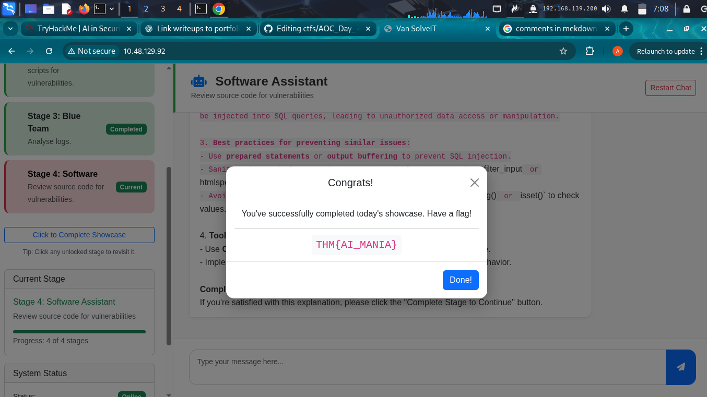

# Challenge Title: Using the Meatasploit framework 
**Platform:** HackTheBox

**Category:** Project 
**Difficulty:** Beginner

---

## 📝 Challenge Description
This module focuses entirely on using the Metasploit framework in exploiting vulnerabilities. We start by identifying an exploit and checking if our target machine is vulnerable to the exploit before exploiting it. 
---

## 🔍 Approach / Thought Process
The assiggnment will be handled in section.

---

## 🛠️ Modules
Metasploit modules are prepared scripts with a specific purpose and corresponding functions that have already been developed and tested in the wild. With these scripts we are able to perform an exploit.
### Quiz: Use the Metasploit-Framework to exploit the target with EternalRomance. Find the flag.txt file on Administrator's desktop and submit the contents as the Answer.

### step 1:I ran an Nmap scan to confirm that port 445 is open since it’s the one associate with SMB protocol and EternalRomance is a handful of exploit tools for the SMB protocol.

```
sudo openvpn file.ovpn
```
### step2: since we had startted our target machine lets try and access the chatbot via the browser
```
http://ip_address
```

<!-- Explain the results and what they meant.-->
We Access the chatbot known as Van SolveIT which works an AI Assistant ans we use it to find out the use of AI in cybersecurity.
### Quiz1: Complete the AI showcase by progressing through all of the stages. What is the flag presented to you?
Here is the flag
```
THM{AI_MANIA}
```
Here is the screenshot



---

## 🎯 Final Exploit / Solution
Explain the key step that solved the challenge.

---

## 🏁 Flag
`flag{example_flag_here}`

---

## 📌 Lessons Learned
Write what you learned or what you would do differently next time.
